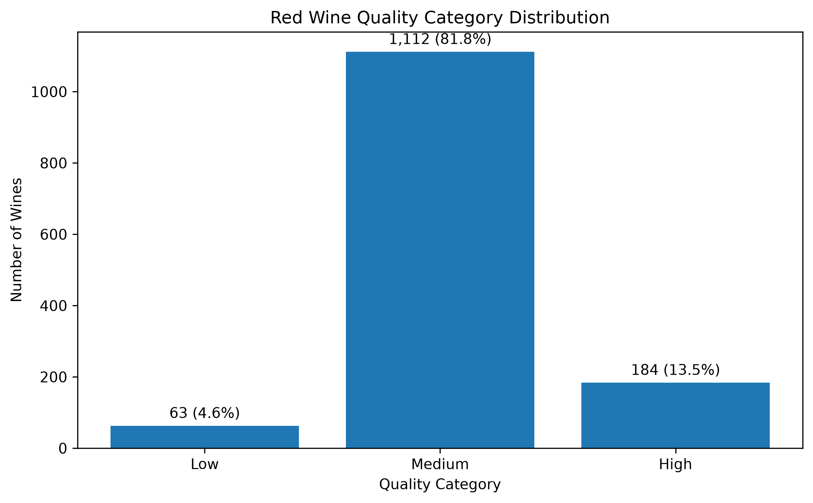
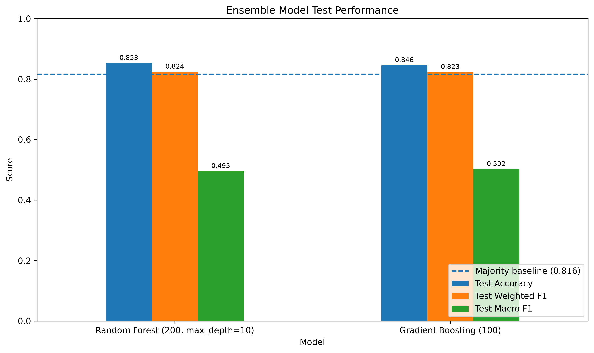
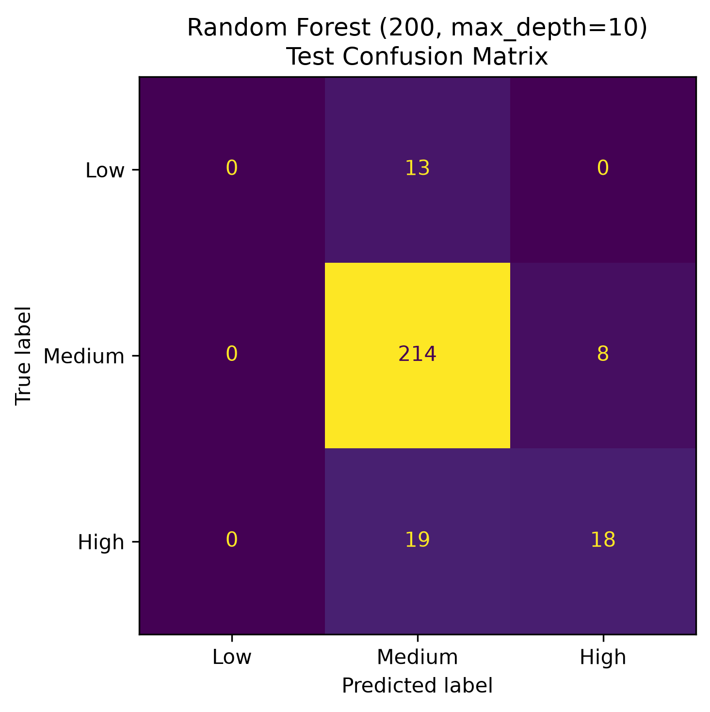
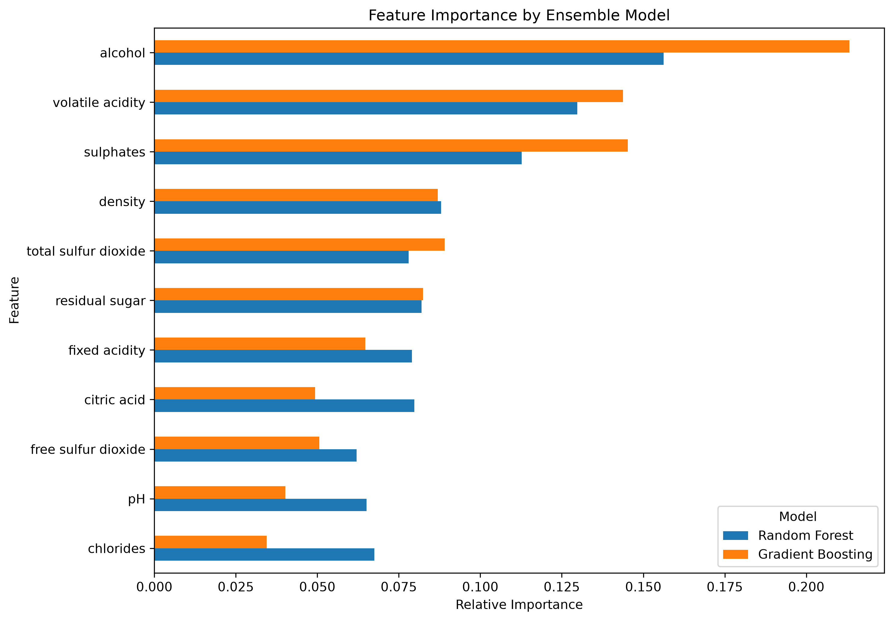

# Project Documentation

This site provides project documentation.
Use the documentation navigation to explore.

## How-To Guide

Many instructions are common to all our projects.

See
[⭐ **Workflow: Apply Example**](https://denisecase.github.io/pro-analytics-02/workflow-b-apply-example-project/)
to get the example projects running on your machine.

## Project Documentation Pages (docs/)

- **Home** - this documentation landing page
- [**Project Instructions**](./project-instructions.md)  - the standard project workflow
- [**Your Files**](./your-files.md) - how to copy the example and create your version
- [**Glossary**](./glossary.md) - project terms and concepts
- [**API**](./api.md) - autogenerated code documentation for the public project interface

## Phase 4. Technical Modification

### Train-Test Performance Gap Analysis

I created a copy of the original ensemble notebook named
[`ml_05_sabri.ipynb`](../notebooks/ml_05_sabri.ipynb).

The original example compared the models using test accuracy only.
I extended the evaluation to include:

- train accuracy
- test accuracy
- accuracy generalization gap
- train weighted F1 score
- test weighted F1 score
- F1 generalization gap
- a results table sorted by test performance
- a chart comparing training and test accuracy

The generalization gaps were calculated by subtracting test performance
from training performance. This provides additional evidence about whether
a model may be overfitting.

### Results

| Model | Train Accuracy | Test Accuracy | Accuracy Gap | Train F1 | Test F1 | F1 Gap |
| --- | ---: | ---: | ---: | ---: | ---: | ---: |
| Random Forest | 1.000 | 1.000 | 0.000 | 1.000 | 1.000 | 0.000 |
| Gradient Boosting | 1.000 | 0.986 | 0.014 | 1.000 | 0.986 | 0.014 |
| Single Decision Tree | 0.967 | 0.986 | -0.018 | 0.967 | 0.985 | -0.018 |

Random Forest produced the strongest result, with perfect training and test
accuracy and no generalization gap on this split.

Gradient Boosting fit the training data perfectly but had a small accuracy gap
of `0.014`. The single decision tree had a negative gap because its result on
this particular test set was slightly higher than its training result. The test
set contained only 69 records, so small differences can noticeably affect the
reported accuracy.

This modification was moderate because calculating the metrics was
straightforward, but organizing the results into a reusable table, sorting the
models, creating the chart, and interpreting the gaps required careful work.

### Evidence

The notebook was restarted and executed from beginning to end after the
modification. The completed run produced the comparison table and chart without
errors.

## Phase 5. Custom Project

### Red Wine Quality Classification with Ensemble Models

For my custom project, I applied ensemble machine learning techniques to a new
multiclass classification problem. I used physicochemical measurements to
classify red wine quality as Low, Medium, or High.

The fully executed project notebook is available here:

[View the Phase 5 wine-quality notebook](https://github.com/sabrouch36/ml-05-ensembles/blob/main/notebooks/project05/ensemble-sabri.ipynb)

This was an intermediate project because I changed the dataset, engineered a
new multiclass target, removed duplicate records, compared two ensemble
approaches, evaluated class-level performance, analyzed generalization gaps,
and interpreted feature importance.

### Basis and Data

The original example used the Penguins dataset to predict penguin species from
physical measurements. For Phase 5, I changed the problem to red wine quality
classification.

I used the Red Wine Quality Dataset from the UCI Machine Learning Repository.
The original file contained 1,599 observations, 11 physicochemical input
variables, and one numeric quality score.

Initial inspection found:

- 1,599 original rows
- 12 original columns
- no missing values
- 240 exact duplicate rows

I removed the exact duplicates before splitting the data. This left 1,359
unique wine records. Removing them reduced the risk of identical observations
appearing in both the training and testing sets and artificially increasing
test performance.

An important limitation is that the engineered quality categories are strongly
imbalanced. Medium-quality wines represent most of the dataset, while the
Low-quality category contains relatively few observations.

### Modeling Approach

This is a supervised machine learning problem because every wine record
contains known input measurements and a known quality score.

It is a multiclass classification task because the target contains three
categories:

- Low
- Medium
- High

I compared two ensemble classifiers:

1. **Random Forest with 200 trees and a maximum depth of 10**
2. **Gradient Boosting with 100 estimators**

Random Forest combines many trees trained on different samples and feature
subsets. Gradient Boosting builds trees sequentially, with each new tree
attempting to correct errors made by the earlier ensemble.

These methods were appropriate because the features are numeric, the target is
categorical, and both models can capture nonlinear relationships without
requiring feature scaling.

### Target

The original wine dataset provides a numeric `quality` score. I converted this
score into three categories:

| Original quality score | Quality category | Numeric target |
|---|---|---:|
| 3–4 | Low | 0 |
| 5–6 | Medium | 1 |
| 7–8 | High | 2 |

After removing duplicates, the category distribution was:

| Quality category | Count | Percentage |
| --- | ---: | ---: |
| Low | 63 | 4.6% |
| Medium | 1,112 | 81.8% |
| High | 184 | 13.5% |

This target changed the task from predicting an exact numeric score to
predicting one of three quality categories. Because the categories were
imbalanced, accuracy alone was not sufficient. Weighted F1, macro F1,
per-class metrics, and confusion matrices were also needed.

### Features

The project used all 11 physicochemical measurements as input features:

- fixed acidity
- volatile acidity
- citric acid
- residual sugar
- chlorides
- free sulfur dioxide
- total sulfur dioxide
- density
- pH
- sulphates
- alcohol

I excluded the original `quality` score and both engineered target columns from
the feature matrix. This prevented target leakage.

The cleaned data was divided into 80% training and 20% testing data using a
stratified split. The resulting shapes were:

- training data: 1,087 rows and 11 features
- testing data: 272 rows and 11 features

Stratification preserved approximately the same class proportions in both
sets.

### Evaluation and Results

I evaluated the models using:

- training accuracy
- test accuracy
- accuracy generalization gap
- weighted precision
- weighted recall
- training weighted F1
- test weighted F1
- weighted F1 generalization gap
- test macro F1
- per-class precision, recall, and F1
- confusion matrices

The majority-class baseline accuracy was `0.8162`. This means a classifier that
always predicted Medium would achieve approximately 81.62% accuracy.

| Model | Train Accuracy | Test Accuracy | Accuracy Gap | Test Weighted F1 | F1 Gap | Test Macro F1 |
|---|---:|---:|---:|---:|---:|---:|
| Random Forest | 0.9696 | 0.8529 | 0.1167 | 0.8241 | 0.1439 | 0.4953 |
| Gradient Boosting | 0.9696 | 0.8456 | 0.1241 | 0.8232 | 0.1454 | 0.5020 |

Random Forest produced the highest test accuracy and weighted F1 score. It also
had the smaller accuracy generalization gap. Based on these overall measures,
Random Forest was the strongest model in this comparison.

Gradient Boosting achieved a slightly higher macro F1 score and correctly
identified 20 of the 37 High-quality wines, compared with 18 for Random Forest.

The overall accuracy results require caution. Random Forest exceeded the
majority-class baseline by only about 3.7 percentage points. Both models also
showed train-test gaps greater than 0.11, indicating noticeable overfitting.

The most important class-level finding was that neither model correctly
identified any Low-quality wine in the test data. All 13 actual Low-quality
wines were classified as Medium.

This result shows why the macro F1 scores were close to 0.50 even though test
accuracy exceeded 0.84. The dominant Medium category strongly influenced the
overall metrics.

### Feature Importance

Both models identified alcohol as the most influential feature. The five
highest features by average importance across the two models were:

| Feature | Average importance |
|---|---:|
| alcohol | 0.1847 |
| volatile acidity | 0.1367 |
| sulphates | 0.1290 |
| density | 0.0875 |
| total sulfur dioxide | 0.0835 |

Feature importance describes how much the fitted models relied on each
measurement. It does not prove that these variables cause changes in wine
quality.

### Limitations and Future Improvements

The main limitation was severe class imbalance, especially the small number of
Low-quality wines. A single stratified train-test split also provides less
reliable evidence than repeated cross-validation.

Future improvements could include:

- collecting more Low-quality examples
- applying class weighting or resampling
- tuning tree depth, learning rate, and ensemble size
- using stratified cross-validation
- optimizing macro F1 rather than accuracy
- testing alternative quality-category boundaries
- evaluating permutation importance or SHAP values

### Summary

I implemented a complete ensemble classification workflow on a new dataset. I
loaded and inspected the data, removed duplicate observations, engineered a
multiclass target, created a stratified train-test split, trained two ensemble
models, measured generalization gaps, examined class-level performance, built
confusion matrices, and compared feature importance.

Random Forest was the recommended model because it achieved the highest test
accuracy of `0.8529`, the highest weighted F1 score of `0.8241`, and a smaller
generalization gap than Gradient Boosting.

However, the project also demonstrated that a strong-looking accuracy score can
hide serious weaknesses. Neither model detected the Low-quality class, so more
balanced data and class-sensitive modeling would be required before using this
approach in a real decision system.

The skills used here could be applied to product-quality classification,
customer-risk categories, manufacturing inspection, medical screening classes,
and other supervised problems where several models can be combined to improve
prediction.
