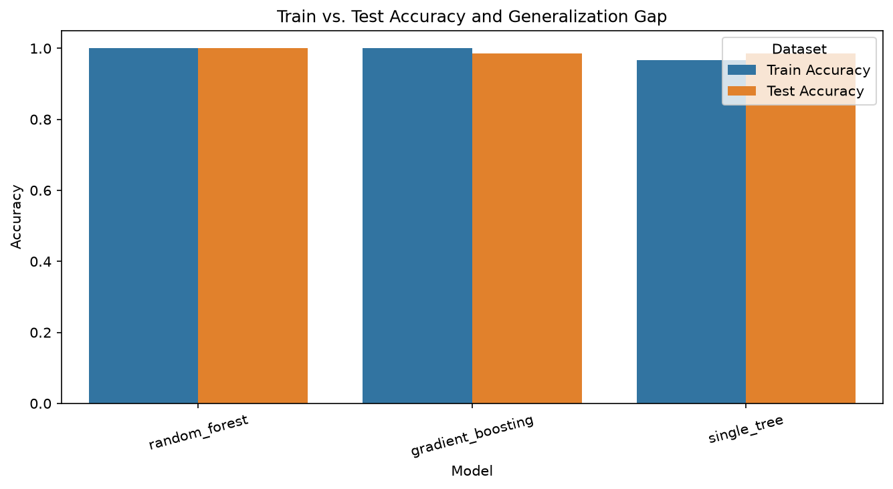

# Project Documentation

This site provides project documentation.
Use the documentation navigation to explore.

## How-To Guide

Many instructions are common to all our projects.

See
[⭐ **Workflow: Apply Example**](https://denisecase.github.io/pro-analytics-02/workflow-b-apply-example-project/)
to get the example projects running on your machine.

## Project Documentation Pages (docs/)

- **Home** - this documentation landing page
- [**Project Instructions**](./project-instructions.md)  - the standard project workflow
- [**Your Files**](./your-files.md) - how to copy the example and create your version
- [**Glossary**](./glossary.md) - project terms and concepts
- [**API**](./api.md) - autogenerated code documentation for the public project interface

## Phase 4. Technical Modification

### Train-Test Performance Gap Analysis

I created a copy of the original ensemble notebook named
[`ml_05_sabri.ipynb`](../notebooks/ml_05_sabri.ipynb).

The original example compared the models using test accuracy only.
I extended the evaluation to include:

- train accuracy
- test accuracy
- accuracy generalization gap
- train weighted F1 score
- test weighted F1 score
- F1 generalization gap
- a results table sorted by test performance
- a chart comparing training and test accuracy

The generalization gaps were calculated by subtracting test performance
from training performance. This provides additional evidence about whether
a model may be overfitting.

### Results

| Model | Train Accuracy | Test Accuracy | Accuracy Gap | Train F1 | Test F1 | F1 Gap |
|---|---:|---:|---:|---:|---:|---:|
| Random Forest | 1.000 | 1.000 | 0.000 | 1.000 | 1.000 | 0.000 |
| Gradient Boosting | 1.000 | 0.986 | 0.014 | 1.000 | 0.986 | 0.014 |
| Single Decision Tree | 0.967 | 0.986 | -0.018 | 0.967 | 0.985 | -0.018 |

Random Forest produced the strongest result, with perfect training and test
accuracy and no generalization gap on this split.

Gradient Boosting fit the training data perfectly but had a small accuracy gap
of `0.014`. The single decision tree had a negative gap because its result on
this particular test set was slightly higher than its training result. The test
set contained only 69 records, so small differences can noticeably affect the
reported accuracy.

This modification was moderate because calculating the metrics was
straightforward, but organizing the results into a reusable table, sorting the
models, creating the chart, and interpreting the gaps required careful work.

### Evidence

The notebook was restarted and executed from beginning to end after the
modification. The completed run produced the comparison table and chart without
errors.

## Phase 5. Custom Project

Describe your custom project and how you made your modeling decisions.

Be specific about what changed from the example project.

### Basis and Data

Describe the dataset, input, or example you started with.

Include:

- The original example dataset or input
- The data source
- Why you chose it, kept it, or changed it
- Any important limitations or assumptions

### Modeling Approach

Describe the problem type and modeling approach for this project.

Include:

- Is this supervised or unsupervised and how do you know
- Is this classification, regression, clustering, recommendation, forecasting, or another type of ML task
- What kind of target works well for this approach
- Why your selected model or method is appropriate

### Target

Describe the example target variable.

Then describe your chosen target variable.

Explain how your target choice changes the modeling approach, interpretation, or evaluation.

### Features

Describe the example features.

Then describe the features you used to predict your target.

Explain what you changed, added, removed, or kept and why.

### Evaluation and Results

Describe how you evaluated your model.

Include:

- The metric or evidence you used
- The main result
- Whether the result was useful, interesting, surprising, or disappointing
- Any weakness, limitation, or next improvement

### Summary

Summarize your custom project.

Include:

- How you implemented your custom model
- What results you got
- What you learned
- How well you exercised the skills covered in this project
- What kinds of real problems you could apply these skills to in the future

Display at least one image or screenshot showing your work.
